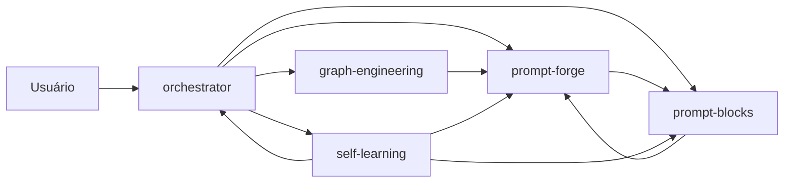

# azvd-toolkit

Toolkit open-source de skills para IA — 5 skills adaptativas para qualquer ecossistema multi-agente.

Toolkit open-source de skills para IA para trabalhar com IA — a versão **versionada em repo** do que foi validado em campo (multi-agentes, graph engineering, padrões de prompt com lição de incidente).

## As 4 skills

| Skill | Função | Trigger |
|---|---|---|
| `orchestrator` | Roteador: decide qual skill usar e encadeia | `/orchestrator` |
| `prompt-forge` | Monta prompts por entrevista interativa e ADAPTATIVA (anatomia Tarefa/Método/Meta + matriz por tipo de pedido) | `/prompt-forge` |
| `prompt-blocks` | Biblioteca de blocos comprovados, cada um com a lição de incidente que o originou | `/prompt-blocks` |
| `graph-engineering` | Task graphs (orquestração multi-agente) + knowledge graphs (pipeline de 9 etapas) | `/graph-engineering` |
| `self-learning` | **A skill que se adapta**: colhe lições de sessão (golden paths) e as transforma em blocos/linhas/rotas novas nas outras skills | `/self-learning` |

## Como as skills se conversam



- `orchestrator` roteia e encadeia (primeira parada de qualquer pedido).
- `prompt-forge` monta o prompt e compõe com blocos de `prompt-blocks`.
- `graph-engineering` planeja a orquestração (fan-out, diamond, human gate); cada ticket vira prompt no `prompt-forge`.
- `prompt-blocks` guarda as lições (outcome) que alimentam todas.

**Regra central:** prompt único gigante buga a IA — tarefa multi-etapa = task graph + um prompt por ticket.

## Origem

Validado em produção no campo (orquestração multi-agente) (2026-08): tickets autocontidos, padrão agente leve analisa → agente forte revisa → humano confere, contrato de memória OKF, teste de decisão autônomo. `graph-engineering` é adaptação de [codejunkie99/graph-engineering](https://github.com/codejunkie99/graph-engineering) (MIT) traduzida para PT-BR, com a metade de task graphs vinda do trabalho DeepMind×MIT. `self-learning` é adaptação de [Kulaxyz/self-learning-skills](https://github.com/Kulaxyz/self-learning-skills) (MIT) — o loop "reconhecer → capturar → reutilizar" com a regra de promoção de 3 verificações, direcionado ao ecossistema deste toolkit (colheita vira bloco no prompt-blocks, linha na matriz do prompt-forge, rota no orchestrator). `prompt-blocks` B9/B10 (memória do projeto, checkpoint) adaptados de [withkynam/vibecode-pro-max-kit](https://github.com/withkynam/vibecode-pro-max-kit) — os 3 repos são vigiados pelo cron semanal de upstream. Padrões de prompt (few-shot, CoT, delimitadores...) vieram do dair-ai/Prompt-Engineering-Guide e f/prompts.chat. Pesquisados e não adotados na rodada: AgentHandover (observa e ensina), rudder (feedback → skills).

## Manutenção (sync + vigilância de upstream)

```bash
bash sync.sh           # propaga repo → 4 IAs (Hermes, agy, claude, dir universal) em 1 comando
bash sync.sh --push    # git add/commit/push + propaga
```

**Vigilância de upstream** (cron semanal `azvd-upstream-watch`): checa os 3 repos originais
(codejunkie99/graph-engineering, Kulaxyz/self-learning-skills, withkynam/vibecode-pro-max-kit).
Só alerta quando há commit novo — mostrando o que mudou — e você decide incorporar (preservando
PT-BR e seções azvd). Silêncio = nada mudou (não relê tudo do zero).

## Instalar como plugin (o jeito "marketplace" — como os caras fazem)

Este repo já é um **plugin + marketplace** válido para o Claude Code (manifests em
`.claude-plugin/plugin.json` e `.claude-plugin/marketplace.json`, no mesmo formato dos
marketplaces oficiais). Depois de publicado no GitHub:

```bash
# 1. No Claude Code — adicionar o marketplace e instalar
claude plugin marketplace add azvd https://github.com/brenoazvd/azvd-toolkit
claude plugin install azvd-toolkit@azvd

# 2. Receber atualizações depois de mudanças no repo
claude plugin marketplace update azvd

# 3. Antigravity (agy) — instalar o plugin direto
agy plugin install azvd-toolkit@https://github.com/brenoazvd/azvd-toolkit
#    ou ponte: agy plugin import claude   (importa plugins do Claude Code)
```

### ⚠️ Bug conhecido: `claude plugin marketplace add` (v2.1.224–226)

O comando está quebrado nesta versão — falha com `Invalid marketplace source format`
mesmo para o marketplace oficial (`anthropics/claude-plugins-official`), em todas as
formas (`owner/repo`, `https://...`, `./path`). Contorno **validado**:

```bash
# 1. Registrar o marketplace manualmente (com backup)
cp ~/.claude/plugins/known_marketplaces.json ~/.claude/plugins/known_marketplaces.json.bak
# adicionar no JSON (mesmo shape das entradas existentes):
#   "azvd": {
#     "source": {"source": "github", "repo": "brenoazvd/azvd-toolkit"},
#     "installLocation": "C:\\Users\\<user>\\.claude\\plugins\\marketplaces\\azvd",
#     "lastUpdated": "<ISO-8601>"
#   }
# 2. Clonar/validar + instalar
claude plugin marketplace update azvd
claude plugin install azvd-toolkit@azvd
```

### Antigravity (agy) — status

Instalação **validada funcionalmente** (as 4 skills aparecem no `agy -p` como carregadas):

```bash
# 1. Criar o plugin em ~/.gemini/config/plugins/azvd-toolkit/:
#    plugin.json  → manifest COMPLETO (não só o name):
#       {"name": "azvd-toolkit", "version": "0.1.0", "description": "...",
#        "author": {"name": "..."}, "repository": "https://github.com/...", "license": "MIT"}
#       (UTF-8 SEM BOM — BOM quebra o parser do agy)
#    installed_version.json → {"version": "0.1.0"}
#    skills/ → as 4 skills como PASTAS REAIS (não junction)
# 2. SKILL.md das cópias: frontmatter SÓ com name + description (remover trigger: e
#    campos extras — o agy rejeita/ignora skills com campos que não conhece)
# 3. Habilitar (escreve em ~/.gemini/config/config.json: {"azvd-toolkit": {"enabled": true}})
agy plugin enable azvd-toolkit
# 4. Validar:
agy plugin validate 'C:\Users\<user>\.gemini\config\plugins\azvd-toolkit'   # "skills: 4 processed"
```

Descobertas do caminho (2026-08-10):
- **Prova funcional**: `agy -p "List ALL skill names..."` lista as 4 skills carregadas. O painel interativo `/skills` mostra um subconjunto curado (não lista nem as skills do lock) — é quirk de UI, não de carregamento; a skill é utilizável normalmente.
- Junction é visível pro `agy plugin validate` mas o carregamento real não a segue — usar pastas reais no plugin.
- `~/.gemini/config/skills/` (junctions → `.agents/skills/<nome>`) é onde ficam skills "avulsas"; o `skills-lock.json` registra fontes github (hash `computedHash` é algoritmo proprietário — não replicar à mão).
- `npx skills add` instala no dir universal `~/.agents/skills/` (codex/cursor/antigravity-cli) — o agy NÃO lê de lá.

### Hermes (este assistente)

```bash
# Cópia direta para o diretório de skills do Hermes (fica ativo na próxima sessão):
cp -r .claude/skills/{orchestrator,prompt-forge,prompt-blocks,graph-engineering} \
      ~/AppData/Local/hermes/skills/
```

## Instalar localmente (sem GitHub — junction ou cópia)

```bash
# opção 1 — junction (fonte = este repo; edita aqui, vale no ~/.claude)
# cmd (Windows), uma por skill:
mklink /J "%USERPROFILE%\.claude\skills\orchestrator"       "%~dp0.claude\skills\orchestrator"
mklink /J "%USERPROFILE%\.claude\skills\prompt-forge"       "%~dp0.claude\skills\prompt-forge"
mklink /J "%USERPROFILE%\.claude\skills\prompt-blocks"      "%~dp0.claude\skills\prompt-blocks"
mklink /J "%USERPROFILE%\.claude\skills\graph-engineering"  "%~dp0.claude\skills\graph-engineering"

# opção 2 — cópia (simples, mas dessincroniza):
cp -r .claude/skills/* ~/.claude/skills/
```
