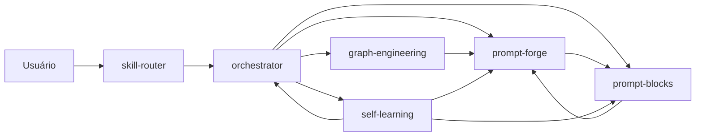

# azvd-toolkit

Toolkit open-source de **skills para IA** (MIT) — 6 skills adaptativas que funcionam em qualquer
ecossistema multi-agente, dos comerciais (Claude Code, Codex, Cursor) aos open source (Kiro,
OpenClaw, Antigravity/agy, Hermes), entre outros. Elas cobrem **orquestração**, **prompt
engineering**, **graph engineering** e **auto-aprendizado**, e foram validadas em campo (não são
teoria).

> Cada skill é pequena, adaptável e composável. Funciona com qualquer modelo. Faça delas as suas.

## As 6 skills

| Skill | O que faz | Trigger |
|---|---|---|
| `skill-router` | **Porta de entrada**: acha a skill certa (1º no azvd, 2º nas skills globais do seu PC) | `/skill-router` |
| `orchestrator` | **Roteador**: decide qual skill do azvd usar e encadeia elas | `/orchestrator` |
| `prompt-forge` | **Forja prompts** por entrevista interativa: cada tipo de pedido (Criação, Código, Análise, Orquestração, Texto) tem um **Modo** que gera o prompt pronto para colar — crítica separada + critério objetivo de parada (filosofia Gauntlet Loop) | `/prompt-forge` |
| `prompt-blocks` | **Biblioteca de blocos** de prompt comprovados, cada um com a lição de incidente que o originou | `/prompt-blocks` |
| `graph-engineering` | **Knowledge graphs** (pipeline de 9 etapas) + **task graphs** (orquestração multi-agente: fan-out, diamond, gate humano) | `/graph-engineering` |
| `self-learning` | **A skill que se adapta**: colhe lições da sessão e as transforma em blocos/linhas/rotas novas nas outras skills | `/self-learning` |

## Como as skills se conversam



- `skill-router` acha a skill (1º azvd, 2º globais); `orchestrator` roteia dentro do azvd.
- `prompt-forge` monta o prompt e compõe com blocos de `prompt-blocks`.
- `graph-engineering` planeja a orquestração (fan-out, diamond, human gate); cada ticket vira prompt no `prompt-forge`.
- `prompt-blocks` guarda as lições (outcome) que alimentam todas.

**Regra central:** prompt único gigante buga a IA — tarefa multi-etapa = task graph + um prompt por ticket.

## Instalação (30 segundos)

Duas formas — escolha uma (instalar as duas duplica as skills):

<details>
<summary><strong>Claude Code (plugin marketplace)</strong></summary>

```bash
claude plugin marketplace add azvd https://github.com/brenoazvd/azvd-toolkit
claude plugin install azvd-toolkit@azvd
```

Recebe atualização automática quando o repo mudar (`claude plugin marketplace update azvd`).

> ⚠️ Bug conhecido: `claude plugin marketplace add` falha em algumas versões (v2.1.224-226).
> Contorno em `MAINTENANCE.md`.

</details>

<details>
<summary><strong>Qualquer agente / `npx skills` (recomendado, universal)</strong></summary>

```bash
# instala em todos os agentes detectados (claude, codex, cursor, antigravity-cli...)
npx skills add brenoazvd/azvd-toolkit -g

# ou escolha o agente
npx skills add brenoazvd/azvd-toolkit -g -a claude-code
```

O instalador mostra as 6 skills e em quais agentes instalar.

</details>

Depois, em qualquer agente, chame `/skill-router` e diga o que quer fazer. Simples assim.

## Qual skill uso quando? (guia rápido)

| Você quer... | Skill |
|---|---|
| "Qual skill resolve isso?" / não sabe por onde começar | `/skill-router` |
| Montar/refinar um **prompt** para agentes | `/prompt-forge` |
| Usar **blocos prontos** de prompt (PARE E REPORTE, teste de decisão...) | `/prompt-blocks` |
| **Orquestrar** N agentes/CLIs/tickets (fan-out, gates) | `/orchestrator` ou `/graph-engineering` |
| **Mapear** código/docs/conhecimento em um grafo, ou fazer task graph | `/graph-engineering` |
| **Ensinar o toolkit**: colher uma lição nova e atualizar as skills | `/self-learning` |

## Exemplo: por onde começar

1. Rode `/skill-router` → *"quero um prompt pra explicar este dashboard"* → ele te manda pro `/prompt-forge`.
2. No `/prompt-forge`, responda a entrevista (ele pergunta 1 coisa por vez). O resultado é um prompt **pronto para colar** em qualquer CLI.
3. Se a tarefa for grande/multi-etapa, o `/orchestrator` te orienta a **dividir em tickets** (task graph + 1 prompt por ticket) em vez de um prompt gigante.

## Extensões opcionais (skills globais que o skill-router vê)

O `skill-router` também varre skills globais instaladas no seu PC. Para adicionar um domínio novo:

```bash
# ex.: framework de segurança (45 skills: AI-security, AppSec, Cloud, Compliance...)
npx skills add UnitOneAI/SecuritySkills -g
```

Depois disso, `/skill-router "review de segurança"` encontra a skill certa automaticamente.

## Origem e créditos

Validado em campo (2026): tickets autocontidos, padrão agente leve analisa → agente forte revisa →
humano confere, memória coletiva / OKF, teste de decisão autônomo. Adaptações (MIT):

- `graph-engineering` ← [codejunkie99/graph-engineering](https://github.com/codejunkie99/graph-engineering) (PT-BR; task graphs baseados no [DeepMind×MIT](https://research.google/blog/towards-a-science-of-scaling-agent-systems-when-and-why-agent-systems-work/)).
- `self-learning` ← [Kulaxyz/self-learning-skills](https://github.com/Kulaxyz/self-learning-skills).
- `prompt-blocks` B9/B10 ← [withkynam/vibecode-pro-max-kit](https://github.com/withkynam/vibecode-pro-max-kit).
- `prompt-blocks` B4(karpathy) ← [forrestchang/andrej-karpathy-skills](https://github.com/forrestchang/andrej-karpathy-skills) (baseado nas observações de [Andrej Karpathy](https://x.com/karpathy/status/2015883857489522876)).
- Padrões de prompt (few-shot, CoT, delimitadores) ← [dair-ai/Prompt-Engineering-Guide](https://github.com/dair-ai/Prompt-Engineering-Guide) e [f/prompts.chat](https://github.com/f/prompts.chat).
- `skill-router` (filosofia) ← [mattpocock/ask-matt](https://github.com/mattpocock/skills).
- Arquitetura geral do repo e filosofia "make them your own" ← [mattpocock/skills](https://github.com/mattpocock/skills).

## Para quem mantém o repo

Manutenção (sync nas IAs, vigilância de upstream, instalação manual do agy, bug do marketplace):
documentação de mantenedor fica local (fora do versionamento público), junto do `sync.sh`.
