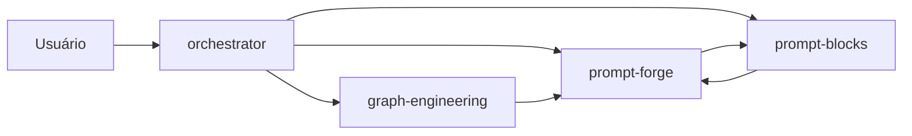

# azvd-toolkit

Toolkit pessoal de skills para trabalhar com IA — a versão **versionada em repo** do que foi validado em campo (orquestração agêntica claude CLI + agy, graph engineering, padrões de prompt com lição de incidente).

## As 4 skills

| Skill | Função | Trigger |
|---|---|---|
| `orchestrator` | Roteador: decide qual skill usar e encadeia | `/orchestrator` |
| `prompt-forge` | Monta prompts por entrevista interativa (anatomia Tarefa/Método/Meta) | `/prompt-forge` |
| `prompt-blocks` | Biblioteca de blocos comprovados, cada um com a lição de incidente que o originou | `/prompt-blocks` |
| `graph-engineering` | Task graphs (orquestração multi-agente) + knowledge graphs (pipeline de 9 etapas) | `/graph-engineering` |

## Como as skills se conversam



- `orchestrator` roteia e encadeia (primeira parada de qualquer pedido).
- `prompt-forge` monta o prompt e compõe com blocos de `prompt-blocks`.
- `graph-engineering` planeja a orquestração (fan-out, diamond, human gate); cada ticket vira prompt no `prompt-forge`.
- `prompt-blocks` guarda as lições (outcome) que alimentam todas.

**Regra central:** prompt único gigante buga a IA — tarefa multi-etapa = task graph + um prompt por ticket.

## Origem

Validado em produção no ecossistema SaaS OEP (2026-08): tickets autocontidos, padrão analyzer→reviewer→verify (agy analisa → claude opus revisa → orquestrador confere), contrato de memória OKF, teste de decisão autônomo. `graph-engineering` é réplica do repo [codejunkie99/graph-engineering](https://github.com/codejunkie99/graph-engineering) (MIT), com a metade de task graphs vinda do trabalho DeepMind×MIT.

## Instalar como plugin (o jeito "marketplace" — como os caras fazem)

Este repo já é um **plugin + marketplace** válido para o Claude Code (manifests em
`.claude-plugin/plugin.json` e `.claude-plugin/marketplace.json`, no mesmo formato dos
marketplaces oficiais). Depois de publicado no GitHub:

```bash
# 1. No Claude Code — adicionar o marketplace e instalar
claude plugin marketplace add azvd https://github.com/brenoazvd/azvd-toolkit
claude plugin install azvd-toolkit@azvd

# 2. Receber atualizações depois de mudanças no repo
claude plugin marketplace update azvd

# 3. Antigravity (agy) — instalar o plugin direto
agy plugin install azvd-toolkit@https://github.com/brenoazvd/azvd-toolkit
#    ou ponte: agy plugin import claude   (importa plugins do Claude Code)
```

## Instalar localmente (sem GitHub — junction ou cópia)

```bash
# opção 1 — junction (fonte = este repo; edita aqui, vale no ~/.claude)
# cmd (Windows), uma por skill:
mklink /J "%USERPROFILE%\.claude\skills\orchestrator"       "%~dp0.claude\skills\orchestrator"
mklink /J "%USERPROFILE%\.claude\skills\prompt-forge"       "%~dp0.claude\skills\prompt-forge"
mklink /J "%USERPROFILE%\.claude\skills\prompt-blocks"      "%~dp0.claude\skills\prompt-blocks"
mklink /J "%USERPROFILE%\.claude\skills\graph-engineering"  "%~dp0.claude\skills\graph-engineering"

# opção 2 — cópia (simples, mas dessincroniza):
cp -r .claude/skills/* ~/.claude/skills/
```
